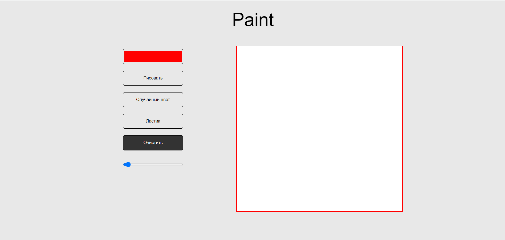

# Рисовалка Paint

Базовая рисовалка, сделанная для тренировки вёрстки с помощью Grid Layout.

Есть функция смены цвета, смены размера "кисти", очистки поля, а также функция случайный цвет, которая генерирует новый цвет каждый раз, когда вы рисуете что-то.

## Ссылка на сайт

https://duglas43.github.io/Scetch/

## Скриншот

